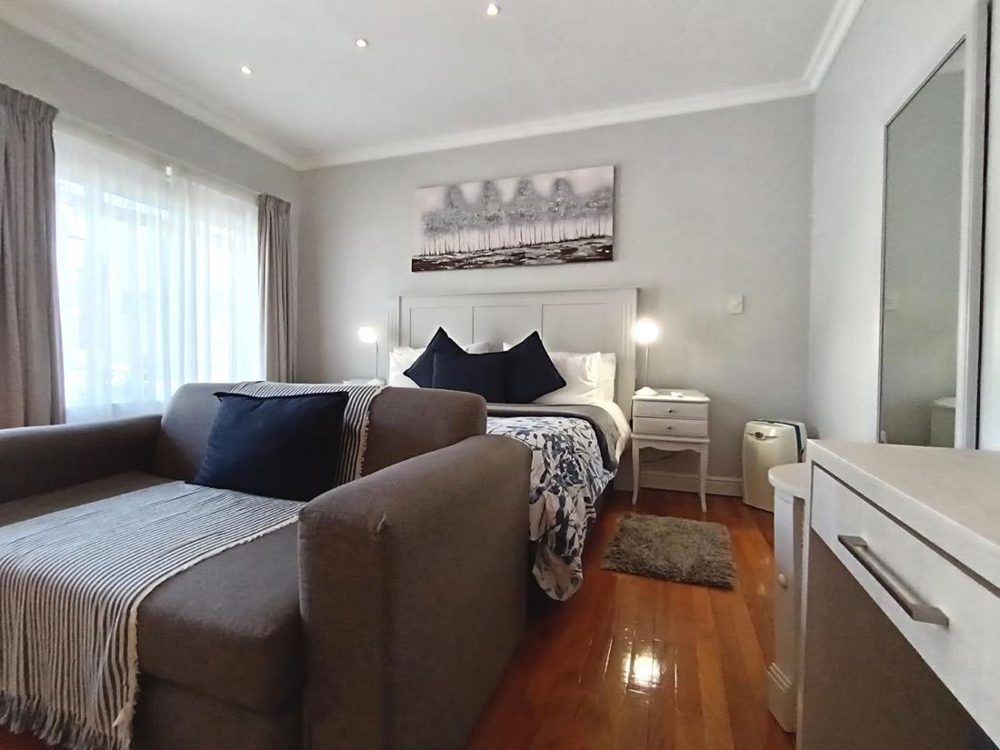

# On The Bay B&B — project notes for Claude

Static site for a bed & breakfast in Summerstrand, Gqeberha. No build step, no
framework, no server-side code, no package.json — `index.html` is the whole
site. See README.md for the human-facing overview (hosting, the callback
form, design notes). This file is context a fresh session won't get from the
code alone.

## Image status — what's real, what's still placeholder

The site launched with generic soft-gradient placeholder images (each has its
filename printed faintly in the corner — that's the tell). Progress replacing
them:

**Done (real photos):**
- `images/hero.jpg` — real garden photo, downsampled from a 5120×3840
  original (`images/hero-original.jpeg`, kept as archival source — not
  referenced by the site). Built with Lanczos resampling straight from the
  full-res original, ~1920×1440, ~700KB. If it ever needs rebuilding
  (different crop, different size), re-derive from `hero-original.jpeg`, not
  from a re-export of the current `hero.jpg` — avoid compounding
  resample/recompress passes.
- All six room cards — see "Room photo convention" below.

**Still placeholder, needs real photos:** `garden.jpg`, `breakfast.jpg`,
`braai.jpg`, `beach.jpg`, `gallery-1.jpg` … `gallery-6.jpg`, `og-image.jpg`.
Same swap-in-place approach as the README describes: replace the file,
keep the filename, no HTML/CSS changes needed for those.

## Room photo convention

Each room card in the "Rooms" section (`index.html`, `#rooms`) uses a
`.room-img-btn` button, not a bare ``:

```html
<div class="room-img">
  <button class="room-img-btn" type="button" data-alt="King room with sofa bed"
          data-photos='["images/rooms/king-sofa/1.jpg","images/rooms/king-sofa/2.jpg",...]'>
    
    <span class="room-img-count">3 photos</span>
  </button>
</div>
```

- Photos live under `images/rooms/<slug>/1.jpg, 2.jpg, ...` — one folder per
  room type, numbered in display order.
- `data-photos` is a JSON array read by `script.js`; clicking the button
  opens the shared lightbox (`#lb`) scoped to just that room's photos, with
  prev/next arrows and a counter. The main gallery grid (`#gallery`) uses the
  same lightbox mechanism but as one shared set across all six grid photos.
- Omit the `.room-img-count` span for a room with only one photo (see the
  family unit card) — the lightbox still opens, just without nav controls.
- Current slugs → room type, for reference:
  `king-sofa`, `twin`, `family-unit`, `garden-double`, `self-catering`,
  `compact-single`. These were matched to the six listed room types (King
  with sofa bed, Twin with extra single, Two-bedroom family unit, Garden
  double, Self-catering room, Compact single) by asking the property owner
  to identify each folder from a description — not guessed from the photos.

## Worth flagging to the owner

Room copy vs. photos don't fully line up and are worth a quick owner check
before launch (separate from the four items already listed in the README):
- The **Garden double** card's copy doesn't mention a kitchenette, but its
  photos (`images/rooms/garden-double/`) show a full kitchenette with sink
  and stovetop.
- The **Self-catering room** card's photos (`images/rooms/self-catering/`)
  show a much smaller kitchenette nook (microwave only) than the garden
  double's — worth confirming the self-catering description still fits.

## Photo processing conventions

When resizing/compressing photos for this site (sips or PIL, either is
fine — no ImageMagick installed):
- Downsample from the highest-resolution source available; don't re-derive
  from an already-downsampled or already-upscaled copy.
- Room photos: capped at 1100px on the long edge, sips `formatOptions
  normal`, landing around 40–115KB each — that's the target range for
  anything in `images/rooms/`.
- Hero/wide banner shots run heavier (~700KB) since they're full-bleed and
  high-detail (foliage/grass compress poorly) — that's an accepted
  trade-off for the LCP image, not a bug.
- `sips -Z <N>` scales to fit *and* upscales if the source is smaller than
  `<N>` — check source dimensions first, or it'll blow up file size for
  no quality gain.

## Deployment

No CI, no build. Static host of any kind (Netlify, Cloudflare Pages,
GitHub Pages, plain cPanel). See README.md § Hosting.
