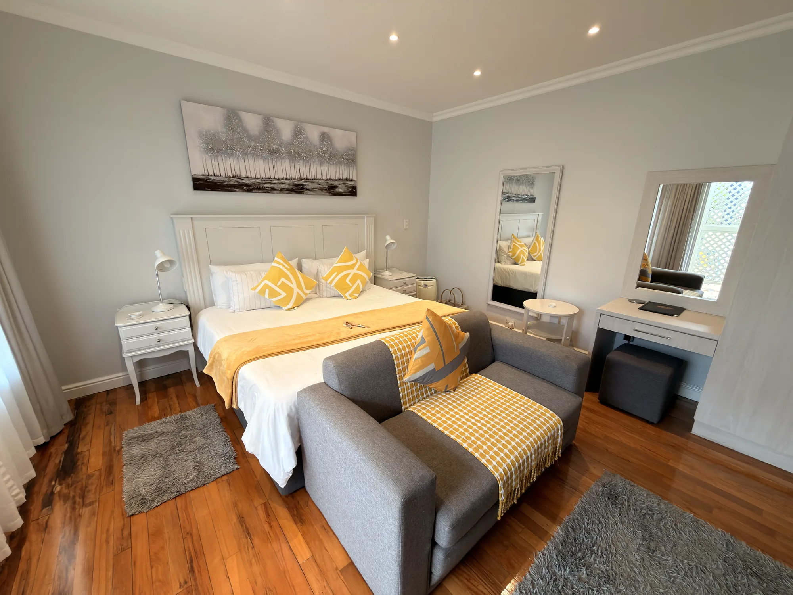

# On The Bay B&B — project notes for Claude

Static site for a bed & breakfast in Summerstrand, Gqeberha. No build step, no
framework, no server-side code, no package.json — every `.html` file is
hand-maintained directly (including the six files under `rooms/` — see
"Room detail pages" below; they were generated once by a scratch script, but
that script isn't part of the repo and nothing regenerates these files
automatically). See README.md for the human-facing overview (hosting, the
callback form, design notes). This file is context a fresh session won't get
from the code alone.

## Image status — what's real, what's still placeholder

The site launched with generic soft-gradient placeholder images (each has its
filename printed faintly in the corner — that's the tell). Progress replacing
them:

**Done (real photos):**
- `images/hero-2.jpg` — the current hero banner (Sept 2026), a garden-path
  shot leading to the guest cottage, downsampled from
  `images/IMG_3459.HEIC` (8064×6048, kept in place as the archival source —
  not referenced by the site). Built the same way as the original hero: PNG
  intermediate via `sips` (HEIC → PNG, lossless), then Pillow Lanczos
  resample to 1920×1440, JPEG `quality=82`. No rotation fix needed for this
  one — the contact-sheet check came back the right way up.
- `images/hero.jpg` — the **previous** hero photo, deliberately left in
  place (and still referenced by nothing) purely so the owner can revert by
  swapping `index.html`'s `.hero-img` `src` back to it — not a "still
  needs replacing" placeholder like the section below. Downsampled from a
  5120×3840 original (`images/hero-original.jpeg`, also kept, also
  unreferenced). If `hero.jpg` (not `hero-2.jpg`) ever needs rebuilding,
  re-derive from `hero-original.jpeg`, not from a re-export of `hero.jpg`
  itself — avoid compounding resample/recompress passes. Same logic applies
  to `hero-2.jpg` vs. `IMG_3459.HEIC`.
- `images/garden.webp` — real pergola/garden photo (Sept 2026), replacing
  the old `images/garden.jpg` placeholder (deleted). Used in the "Welcome"
  section's `.split-fig`.
- `images/bookbox-wave.webp` — real wave photo (Sept 2026), used as the
  background of every room page's `.bookbox-head` (see "Room cards → room
  detail pages" below for the full story, including why the resize recipe
  for this one specifically isn't the usual plain `im.resize()`). Source:
  `images/asideimage.png`, kept as the archival original.
- Five of six room cards — `king-sofa`, `twin`, `self-catering`,
  `family-unit`, `compact-single`. Reshot twice: an initial Sept 2026 pass
  (Claude sifted a raw phone-photo dump for the best/least-repetitive shots,
  JPEG), then redone the same month at the owner's request once they'd
  picked their own favourites from a second raw dump — that second pass is
  what's live now, exported as WebP (see "Photo processing conventions").
  In both passes photos came from `images/OTB/` (one subfolder per room,
  `Room 1`…`Room 6`, matched to room-type slugs by asking the owner — not
  guessed from the photos). The raw dumps (630MB, then 151MB, both HEIC)
  were deleted after processing, at the owner's request each time — there
  is no archival source for these like `hero-original.jpeg`; a different
  crop/photo needs a fresh export from the owner's phone/cloud backup.
- **`garden-double` was NOT reshot in either pass** — its `Room 4` folder
  was uploaded empty both times, so it still has the pre-Sept-2026 photo set
  (JPEG, `images/rooms/garden-double/1.jpg`…`4.jpg`). A fresh shoot for this
  room is still pending; when photos do arrive, process them the same way
  as the other five (see "Photo processing conventions") and update both
  the homepage card and `rooms/garden-double.html` (see below).
- `images/gallery-1.webp` … `gallery-6.webp` — the homepage's `#gallery`
  ("A look around") grid, replacing the six soft-gradient placeholders
  (Sept 2026). Source: `images/LookAround/LookAround1.jpg`…`6.jpeg` (owner-
  supplied, kept in place as the archival originals, matching the
  hero/garden/bookbox precedent above rather than the room-photo one, which
  deletes its raw dumps). Processed with the same pipeline as the room
  photos (2000px long edge, WebP `quality=82, method=6`) rather than the
  plain-JPEG one the README used to describe for this file set — these
  photos open in the same `#lb` lightbox the room galleries use, so the
  same "why 2000px" reasoning in "Photo processing conventions" below
  applies to them too, not just to room shots. `ImageOps.exif_transpose()`
  was run before resizing (none of the six actually needed it — all came
  out upright — but cheap insurance, unlike the room photos' HEIC source
  which has no usable orientation tag at all and needs the contact-sheet
  method instead). The six source photos weren't assigned to gallery slots
  in upload order — slots 1, 4 and 5 render as a wide 8:3 crop and 2, 3
  and 6 as 4:3 (see below), so the two naturally panoramic garden-path
  shots and the wide-doorway dining room shot went in the wide slots, and
  the three closer/detail shots (a dresser, a "Welcome" shelf, a patio
  corner) went in the square-ish ones — a crop that fights a photo's own
  framing is the usual way this kind of mosaic ends up looking broken.
- `images/gallery-7.webp` … `gallery-14.webp` — eight more real photos
  (Sept 2026, same day, same owner upload — `images/LookAround/LookAround7
  .jpeg`…`14.jpg`, same archival-source-kept treatment, same WebP pipeline),
  added in a follow-up request specifically so the site had more than 6
  "around the property" shots without crowding the page on load — see
  "'See more photos'" below for how they're revealed, and the mosaic
  pattern note just below that for how they still get the same wide/narrow
  treatment as photos 1–6 despite arriving after the original six-photo
  mosaic was hand-tuned.

**Gallery mosaic pattern.** `.grid-gal-mosaic .gal-item:nth-child(4n+1)`
and `:nth-child(4n)` render wide (2 grid columns, an 8:3 crop); everything
else stays the grid's default 1-column 4:3 tile. In a 3-column grid this
alternates which side of each row the wide tile falls on — tile 1 wide,
2 narrow; 3 narrow, 4 wide; 5 wide, 6 narrow; 7 narrow, 8 wide; and so on,
repeating forever. This replaced an earlier version hardcoded to exactly
`:nth-child(1), :nth-child(4), :nth-child(5)` (correct only for a fixed
6-photo grid) once "See more photos" (below) meant the grid could hold
more than 6 — the `4n`/`4n+1` formula keeps producing the same one-wide-
tile-per-row rhythm no matter how many photos get revealed, instead of
every tile past 6 falling back to a flat, un-mosaicked grid.

**"See more photos" — the homepage gallery only shows 6 photos up front.**
All 14 `.gal-item` buttons are in the DOM from page load (`index.html`'s
`#gal`), but the 8 that aren't among the first 6 carry a plain `hidden`
attribute in the markup, and a `<button id="galMore">See more photos</button>`
sits in a `.gal-more-row` right after the grid. `script.js`'s `#galMore`
click handler un-hides the next 4 still-hidden `.gal-item`s each time it's
clicked (`#gal .gal-item[hidden]`, sliced to 4), and hides the button
itself once none are left. Two clicks exhausts 8 photos (4 + 4). A photo
count that isn't a multiple of 4 still works fine — the last click just
reveals whatever's left, same as the loop's own `.slice(0, 4)` naturally
handles a shorter remainder.

Two things worth knowing if this needs touching again:
- **The lightbox's own photo set is built once at page load from every
  `.gal-item` in the DOM, hidden or not** (`document.querySelectorAll
  ('.gal-item')` doesn't care about the `hidden` attribute or `display`).
  So opening the lightbox on photo 1 and clicking "previous" wraps
  straight to photo 14/14, even if "See more photos" was never clicked —
  this is intentional, not a bug to "fix" by scoping the lightbox to only
  visible tiles. It means the lightbox and the on-page reveal are two
  independent ways to reach the same photos, not one gating the other.
- **`.btn[hidden]` needed an explicit override to actually hide.** `.btn`
  sets `display:inline-flex` in the author stylesheet; the browser's own
  default `[hidden]{ display:none }` rule lives in the *user-agent*
  stylesheet, which always loses ties to an author-stylesheet rule of the
  same specificity, regardless of which one is more "specific-looking" —
  so `galMore.hidden = true` silently did nothing visually until
  `.gal-more-row .btn[hidden]{ display:none }` was added in styles.css to
  re-assert it at author-stylesheet specificity. Worth remembering for any
  future `hidden`-toggled `.btn` elsewhere on the site — the same silent
  failure will happen again without a matching override.

**Still placeholder, needs a real photo:** `og-image.jpg`. Same
swap-in-place approach as the README describes: replace the file, keep the
filename, no HTML/CSS changes needed.

`beach.jpg` (a placeholder gradient) and the `.wide-fig` figure that displayed
it — a full-width band under the "What's around us" distances/trips grid —
were removed entirely (Sept 2026) at the owner's request, rather than left
for a future photo swap-in. If a similar wide banner photo is wanted there
again later, it needs new markup, not just a dropped-in file — `.wide-fig`
no longer exists in styles.css.

## Room cards → room detail pages

Each room card — on the homepage's "Rooms" section (`index.html`, `#rooms`,
still there, unchanged in substance) **and** on the dedicated rooms listing
page (`rooms/index.html`, see below) — is a short teaser that **links to its
own page**, it doesn't open a lightbox itself:

```html
<a class="room" href="rooms/king-sofa.html">
  <div class="room-img" data-room-carousel data-slug="king-sofa" data-count="9" data-ext="webp" data-alt="King room with sofa bed">
    
    <span class="room-badge room-badge--light"><svg ...>...</svg>Private patio</span>
    <div class="room-carousel" aria-hidden="true">
      <button type="button" class="room-carousel-btn room-carousel-prev" aria-label="Previous photo of King with sofa bed">...</button>
      <span class="room-carousel-count">1 / 9</span>
      <button type="button" class="room-carousel-btn room-carousel-next" aria-label="Next photo of King with sofa bed">...</button>
    </div>
  </div>
  <div class="room-body">
    <p class="eyebrow">Room type</p>
    <h3>King with sofa bed</h3>
    <p>One king-size bed with a sofa bed suitable for a child under 12. Opens onto its own patio.</p>
    <div class="room-tag">
      <ul class="spec">
        <li><svg ...>...</svg>1 king bed + sofa bed</li>
        ...
      </ul>
      <span class="room-view">View room <span class="room-view-arrow" aria-hidden="true"><svg ...>...</svg></span></span>
    </div>
  </div>
</a>
```

**The whole card is one `<a>`** — clicking anywhere on it (photo, title,
description, specs) goes to the room's page. There's no separate "Enquire"
control on the card any more (there was, briefly; removed at the owner's
request — clicking a card only ever meant "tell me more", the per-card
Enquire shortcut was redundant with the one already on the room's own
page). Because of that, `<h3>` and `.room-view` are **plain text/`<span>`,
not nested `<a>` tags** — the HTML spec doesn't allow anchors inside
anchors, and it used to be one (`.room-img-link`, `<h3><a>`, `.room-actions`
with a second `<a class="link-enq">`) before this simplification.
`.room-view`'s trailing arrow is a small `.room-view-arrow` circle
(30px, dark, turns `--rose-deep` and nudges right on card hover) rather
than a bare "→" character — reverted from an even bigger version of this
(a rule stretching across the whole row to a 38px button) the owner tried
and didn't want, back to something closer to the original but with the
circle kept.

**Badge + working photo carousel, added Sept 2026** to match an
owner-supplied mockup: a small feature **badge** top-left of the photo,
and prev/next controls + a "1 / 9" counter that cycle that room's own
`images/rooms/<slug>/` photo set right on the card, in place of the old
static "9 photos" text. This briefly forced the card apart into an
image-link + title-link (a `<button>` isn't valid content inside an `<a>`,
and the carousel needed real buttons) — **reverted at the owner's
request**, who wanted click-anywhere-on-the-card back. The fix: the
carousel buttons stay nested inside the single `<a>` (a real HTML
conformance wart — interactive content inside a hyperlink — kept on
purpose) and their click handlers call `e.stopPropagation()` in
`script.js`, the same trick `.lb-prev`/`.lb-next` already use against the
lightbox `<dialog>`, so a button click never bubbles up to trigger the
card's own navigation. **If a future change needs another *link* (not a
button) inside the card again, this trick won't help** — nested `<a>`s
really do get broken apart by the browser's own parser, unlike nested
buttons — pull the card back apart the way it briefly was, don't try to
stopPropagation a nested anchor.

The carousel is `script.js`'s `data-room-carousel` block: it reads
`data-slug`/`-count`/`-ext`/`-alt` off `.room-img` and rewrites the `` + counter text on click, no page reload and no lightbox involved
(it's a separate, much lighter mechanism than the `#lb` lightbox that
powers the *gallery* grids elsewhere).

The feature badges (`.room-badge`, alternating `--light`/`--dark` pill
styling down the row purely for visual rhythm, not tied to meaning) are
short, defensible, feature-based lines the owner should feel free to
edit — **not** verified marketing claims like "most popular" (no booking
data backs that up), so each one describes something already true of the
room's own spec instead: king-sofa "Private patio", twin "Flexible
option" (it really does convert between 2 singles and a king+single),
family-unit "Great for families", garden-double "Garden views",
self-catering "Self-catering", compact-single "Solo & short stays".

A small wave-doodle watermark low in each `.room-body` (`.room-body::after`,
an inline SVG data-URI, ~5% opacity) echoes the same ripple motif as
`.bookbox-head-waves` on the room detail pages — pure decoration, `z-index`
places it behind the card's own text.

The card's visual language (rounded card with hover lift/shadow, `.room-tag`
pairing an icon spec-list with "View room" widening its arrow gap on hover)
was built to match a reference site's room-card layout the owner pointed to
(relaxedcityliving.co.za/rooms) — colours/type swapped for ours, structure
and interaction kept close to the original (that reference site's own card
is also a single `<a>` with no separate CTA inside it). The badge/carousel
addition above is a departure from that reference (it doesn't have either),
sourced from a second, separate mockup the owner supplied instead. Both are
a deliberate departure from the rest of the site's flatter, sharper-cornered,
shadowless look; that's intentional, not drift, so don't "fix" it back to
match `.btn`/`.gal-item`/etc. `--r` (the sitewide 3px radius token) is
untouched — these cards use their own 14px radius, scoped to `.room`.

**All 6 cards are meant to end up roughly the same height and the same
background.** `.room-tag` has `margin-top:auto`, so it sits at the bottom
of the card regardless of how long the description or spec list above it
runs — which means one noticeably longer card (more paragraph text, or one
extra spec line) drives the whole row's height (CSS grid stretches every
card in a row to match) and leaves the shorter cards with an ugly gap above
their spec row. `family-unit` hit this twice: a 3-sentence description
where everyone else had 1–2, and a 4-line spec list where everyone else had
3 (plus, at one point, a distinct sand-tinted `.room-feature` background —
since removed; all 6 cards now share the same `--paper` background, at the
owner's request, so there's no lingering visual "this one's special"
signal either). Both fixed the same way, in the (repo-external) generator's
`ROOMS` data: a shorter `"card_body"` and a trimmed `"card_spec"`
(`.get("card_spec", room["spec"])` in `card_helpers.py`'s
`room_card_html()`), each falling back to the full `"body"`/`"spec"` used
on the room's own detail page, which isn't grid-height-constrained the same
way — so the full facts (including "Kitchenette") are still there, just not
on the card. If a future edit makes one card's copy or spec list noticeably
longer than the rest again, same fix: add/shorten a `"card_body"` /
`"card_spec"` rather than letting it stretch the row.

**`.spec` icons are keyed off exact spec text**, not computed — see
`SPEC_ICON` in the (repo-external) generator's `card_helpers.py`. A new
spec line with no matching entry there would need one added; there's no
runtime fallback, the mapping is baked into the HTML at generation time.

The room's own page (`rooms/<slug>.html`) is a banner-hero + two-column
layout, redone (Sept 2026) to match a room detail page on the reference
site the card design was already ported from
(relaxedcityliving.co.za/rooms/city-escape):

- **`.hero.hero--room`** — the same `.hero`/`.hero-img`/`.hero-scrim`
  markup the homepage hero uses, just a shorter modifier (`min-height:min(
  58svh,500px)`, no lede/CTA row, title pinned to the bottom via
  `.hero--room .hero-inner{ display:flex; justify-content:flex-end }`) and
  using the room's own photo #1 as the background image. Because this is a
  real `.hero` element, `script.js`'s header logic (`hasHero =
  !!document.querySelector('.hero')`) now makes the header transparent-
  over-the-photo and solid-on-scroll here too, the same as index.html —
  room pages no longer force `.stuck` immediately the way they did before
  this redesign (there was no hero to be transparent over then).
- Below that, a breadcrumb ("Home / Rooms / *Room title*") and a
  **`.roomlayout`** two-column grid: a sticky **`.bookbox`** on the
  **left** (340px, `position:sticky`) and the description + gallery in
  `.roomlayout-main` on the right. Left, not right, deliberately — the
  thing that actually drives a booking decision reads first, before the
  photos. Collapses to a single column under 900px, box first (it's
  already first in the DOM, so no `order` hack needed), no longer sticky.
- `.bookbox` is the "Check availability" card, redesigned twice in
  Sept 2026 to match owner-supplied mockups — first to a solid-`--ink`
  header with a CSS-drawn wave seam, then to a **real wave photo**:
  - `.bookbox-head`: `.bookbox-head-img` is `images/bookbox-wave.webp`, a
    real ocean photo the owner dropped in (`images/asideimage.png`, kept
    as the archival source, not referenced by the site) that already has
    the wave shape **baked into its own alpha channel** — the owner
    supplied it pre-cut, so there's no CSS clip-path/mask involved at all,
    the wave edge is just wherever the PNG's alpha drops to 0. Resized to
    900px wide for `bookbox-wave.webp`, same WebP pipeline as everything
    else — except plain `im.resize()` on the raw RGBA left a visible dark
    fringe along the cutout edge (Lanczos blending each transparent
    pixel's opaque-but-irrelevant black RGB into the neighbouring opaque
    teal pixels); fixed by alpha-compositing the source over a white
    canvas first (so the RGB feeding the resize is white at the edges,
    not black) and reattaching the original, un-composited alpha
    afterward — see the resize step for the exact recipe if this image
    ever needs rebuilding from `asideimage.png` again.
    Over the photo: the calendar icon, "Check availability" as a serif
    `<h3>`, a small uppercase "Plan your stay" eyebrow, a `.bookbox-head-
    scrim` gradient behind just that text for legibility, and three
    ripple-line squiggles (`.bookbox-head-waves`, plain stroked SVG paths)
    echoing the water lower down.
  - **Two rendering gotchas hit building this, both left as comments in
    the CSS but worth restating here since they're easy to reintroduce:**
    - `.bookbox-head-img`/`.bookbox-head-scrim` must **not** carry a
      negative `z-index`. `.bookbox-head` is `position:relative` without
      its own `z-index`, so it doesn't establish a stacking context —
      children with `z-index:-1`/`-2` paint *behind the element's own
      background*, not just behind its other children, which made the
      photo invisible the first time (page showed a flat `--ink` rectangle
      with only the SVG squiggles visible on top). Fix: no `z-index` on
      either — plain DOM order (img, then scrim, then the text block)
      already paints them correctly back-to-front.
    - `.bookbox-head`'s own `background` has to be `var(--paper)`, not a
      dark fallback colour. The photo's alpha cutout doesn't reveal
      `.bookbox-body` (a separate, later sibling box it doesn't overlap)
      — it reveals **`.bookbox-head`'s own background**, since that's what
      is actually sitting behind the `` inside the same element. With
      `--ink` there (left over from the solid-header version), the cutout
      showed a dark-green band between the surf and the paper body instead
      of blending straight into it — looked exactly like a stray dark
      fringe at first glance, which is what sent troubleshooting toward
      the resize/z-index issues above before the real cause (just the
      wrong background-color on the right element) turned up.
  - `.bookbox-body`: a `dl.bookbox-facts` of icon-led `dt`/`dd` rows built
    from the room's own spec list — labelled by a simple keyword
    heuristic (`sleep` → **Sleeps**, `kitchenette` → **Kitchen**,
    `shower`/`bath`/`en-suite` → **Bathroom**, else → **Bed**), each icon
    sitting in its own `.bookbox-icon` circle badge (reusing the exact
    same bed/people/bathroom/kitchen icon paths as the room-card `.spec`
    icons, just recoloured/recircled for this card). A room with no
    bathroom line in its spec (currently just `self-catering`) simply
    gets no Bathroom row — not invented. Two more rows, **Check-in
    14:00** / **Check-out 10:00** (same for every room, confirmed from
    the booking listings — see README), follow after a solid `.row-stay`
    divider separating "what the room is" from "when you can have it".
    Below the facts: two full-width **pill** buttons (`.bookbox-btn`,
    `border-radius:100px` — deliberately not the sitewide `.btn` shape,
    same "this component gets its own rounder language" precedent as the
    room cards) — solid **"Check dates & book"** (calendar + arrow icons)
    straight to Nightsbridge (`https://book.nightsbridge.com/26870`, new
    tab, same link used sitewide — Nightsbridge doesn't take a per-room
    query param), and outline **"Enquire about this room"** (photo +
    arrow icons) to the callback form (see below). Then a small
    horizontal-rule-flanked WhatsApp icon (`.bookbox-fine-rule`, reusing
    the same speech-bubble path as the floating `.wa-float` button) above
    a **"Prefer WhatsApp?"** line — there's no separate WhatsApp *button*
    here, on purpose: it'd be a third competing CTA redundant with the
    always-on floating icon (see README), so the link is kept but
    de-emphasised to text.
  - **Grid-overflow gotcha, watch for it if this box changes again:** the
    mobile breakpoint (`@media (max-width:900px)`) collapses `.roomlayout`
    to one column. That rule must stay `grid-template-columns:minmax(0,
    1fr)`, **not** a bare `1fr` — a CSS grid item's default `min-width` is
    `auto`, which still honours a deep descendant's intrinsic content
    width (e.g. anything `white-space:nowrap`, like the button text
    briefly was during this redesign), so a bare `1fr` track will grow
    the whole track — and the page — past the viewport into horizontal
    scroll rather than let that descendant wrap. `minmax(0,…)` is what
    actually lets the track shrink below its content.
- `.roomlayout-main` has the description (`<p class="eyebrow">About the
  room</p>` + the same body paragraph used elsewhere for this room) and a
  **`Photos`**-labelled gallery: every photo for the room in a
  `.grid-gal.grid-gal-feature` grid, using the **same shared lightbox**
  (`#lb` + `script.js`) that powers the homepage's own `#gallery` grid —
  `script.js` just wires up whatever `.gal-item` buttons exist on the
  current page, so none of this needed new JS. `.grid-gal-feature` makes
  just the first photo a 2×2 feature tile (`.gal-item:first-child{
  grid-column:span 2; grid-row:span 2 }`, ported from the reference site's
  own `.gallery button:first-child` rule) — generalising to any photo
  count, same as the homepage gallery's own `4n`/`4n+1` mosaic pattern
  does now (see "Gallery mosaic pattern" above; scoped to its own
  `.grid-gal-mosaic` modifier class on `#gallery`'s grid), rather than the
  flat `.grid-gal-uniform` modifier this replaced (removed, no longer used
  anywhere).
  **`.grid-gal-feature` explicitly resets every tile** (`grid-column:span
  1; grid-row:span 1`, 4/3 aspect) before re-applying the span to
  `:first-child` — it can't just rely on `.gal-item`'s own defaults,
  because the homepage's `.gal-item:nth-child(1/4/5)` mosaic rules used to
  be unscoped `.grid-gal` defaults and would otherwise leak into *every*
  `.grid-gal` on the site, room pages included (this actually happened —
  first ship of this gallery had photos #1, #4 and #5 on every room page
  incorrectly forced wide with an 8/3 crop from the homepage's rule, not
  the intended 2×2 square feature tile — fixed by scoping the mosaic rules
  to `.grid-gal-mosaic`, which only `index.html`'s `#gallery` div carries,
  instead of leaving them as a `.grid-gal` default every other page has to
  fight). If a third gallery layout is ever needed, give it its own
  modifier class the same way rather than adding more unscoped
  `.gal-item:nth-child(n)` rules.
- Below `.roomlayout`, in its own section: the other five rooms as plain
  link pills (`.room-more`/`.room-more-link`), unchanged by this redesign.

**Three places to update, not one.** The homepage card, the `rooms/index.html`
listing card, and the room's own page all reference the same photo set
independently. Changing a room's photo *count* means updating *all three*:
the card's `.room-img` `data-count` (and its initial `.room-carousel-count`
text, "1 / N") in `index.html`, the same pair in `rooms/index.html`, and the
full `<div class="grid-gal grid-gal-feature">` list in `rooms/<slug>.html`
(plus that page's `.hero-img` `src`/`alt` if photo #1 changed — it's the
room's hero banner now, not a small intro figure). The card's own `` only ever needs to point at `1.<ext>` — the carousel derives every
other photo's path from that at click-time, it doesn't need a full list on
the card. There's no shared data source between any of these — the two
card instances and the one generator script that originally wrote them
(see below) all just happen to agree today because they were written from
the same data at the same time, not because anything enforces it going
forward.

- Photos live under `images/rooms/<slug>/1.webp, 2.webp, ...` (still `.jpg`
  for `garden-double`, see above) — one folder per room type, numbered in
  display order. Current counts: `king-sofa` 9, `twin` 6, `family-unit` 11,
  `garden-double` 4, `self-catering` 7, `compact-single` 4.
- Slugs → room type: `king-sofa`, `twin`, `family-unit`, `garden-double`,
  `self-catering`, `compact-single` — matched to the six listed room types
  by asking the property owner to identify each `Room N` folder, not
  guessed from the photos.
- Room pages live at `rooms/<slug>.html` (one level down from the site
  root), so every internal reference on them is `../`-prefixed
  (`../styles.css`, `../images/...`, `../index.html`, `../script.js`) —
  except links to the rooms listing page or another room page, which are
  siblings in the same folder and just `index.html` / `<slug>.html`.
- "Enquire about this room" on a room page links to
  `../index.html?room=<Room+Name>#callback` (space-as-`+`, matching
  `application/x-www-form-urlencoded`). `script.js` reads that `room` query
  param via `URLSearchParams` on load and preselects it in the `#f-room`
  dropdown, using the same `selectRoomOption()` helper. The option text
  must match exactly (it's a plain text match against `<select>` option
  text, e.g. `"King with sofa bed"`).

### Rooms listing page (`rooms/index.html`)

A dedicated rooms index, separate from both the homepage's `#rooms` section
and the individual `rooms/<slug>.html` pages — added so the header/footer
**"Rooms" nav link** could point somewhere more room-focused than an anchor
scroll. On `index.html` and every `rooms/*.html` page, `<a href="...">Rooms
</a>` now points here (`rooms/index.html` from the root, plain `index.html`
from inside `rooms/`) instead of `#rooms`. The homepage's own `#rooms`
section (`id="rooms"` on that `<section>`) is untouched and still there —
the anchor target still exists, it's just no longer what the nav link goes
to; each room detail page's own breadcrumb ("Home / Rooms / *Room title*")
also links its "Rooms" segment here rather than back to the homepage
section.

Structure: breadcrumb ("Home / Rooms") + intro + the six room cards all
share **one** `<section class="band band-paper page-top">` — `.page-top`
is the one surviving user of the flat-140px fixed-header-clearance trick
(`.room-top`, used by individual room pages, dropped it once those pages
got their own `.hero--room` banner to sit under the header instead — see
above) — deliberately one
separate `<section>`s (both `band-paper`, so no visible colour seam), which
looked fine in markup but doubled `.band`'s `padding-block` where they met
— `--band` (64–124px) of bottom padding on the intro section stacked with
another `--band` of top padding on the cards section, ~130–250px of dead
air between the lede and the first card row that had no visual reason to
be there. Padding doesn't collapse like margin does, so two adjacent
same-background bands is *never* the right way to add breathing room
between an intro and what follows it — use `.sec-head`'s own
`margin-bottom` (already `clamp(36px,5vw,64px)`) for that, or increase it,
rather than reaching for a second section. After the cards: a "Not sure
which one?" section (`<dl class="facts guide">`, one
guest-scenario-to-room mapping per row, all six rooms used exactly once,
phrased directly from each room's own existing copy/specs — not invented)
→ a closing CTA band (`.band-rose`, `.cta-band`) with "Request a callback"
/ WhatsApp. No lightbox markup on this page — the cards link out rather
than open one, so there's no `.gal-item` to power.

### "Rooms" nav dropdown

The header's "Rooms" link (on every page — `index.html` and all 7
`rooms/*.html` pages) is a `.nav-item` wrapping a real link
(`.nav-trigger`, still goes straight to `rooms/index.html` on click) plus
a `.nav-dropdown` listing all six rooms, revealed on `:hover`/
`:focus-within` (CSS only, no JS). Each room's own page marks itself
`aria-current="page"` in its own dropdown entry. Since hover doesn't exist
on touch, the `@media (max-width:760px)` block resets `.nav-dropdown` to
`position:static` and always-visible — it just renders as an indented
sub-list under "Rooms" in the slide-down mobile menu instead of a floating
panel. **Two more places to update if a room is ever renamed/added/
removed**, on top of the "three places" already listed above for cards:
the `.nav-dropdown` list is hand-written on **all 8 pages**, not
generated — there's no shared data source for it either.

## Callback form — currently hidden

The `#callback` section on `index.html` still exists (nav, footer, and
every `rooms/*.html` page's callback link all still point at it), but the
actual `<form class="cb-form" id="cbForm">…</form>` inside it is
**commented out** (Sep 2026, at the owner's request — "hide so long, bring
it back upon my request"), not deleted. With the form gone, `.cb-intro`
(direct phone/WhatsApp/email list + "Good to know" facts) is the section's
only content, so `.cb` (the two-column grid `.cb-intro`/`.cb-form` normally
splits) carries a `cb--solo` modifier class that collapses it to one
centered, width-capped column instead — without that class the intro block
would strand itself in the grid's left half with a blank right column.
Within that solo column, the contact list and "Good to know" facts (a
`<ul class="cb-direct">` and a `<div>` wrapping the `cb-gk` heading + facts
list, both now sharing a `.cb-cols` wrapper `<div>`) sit **side by side**
rather than stacked — `.cb--solo .cb-cols` is a two-column grid, scoped to
`.cb--solo` on purpose: `.cb-cols` on its own (no `.cb--solo` ancestor)
stays an unstyled stack, since the narrower ~46%-width column `.cb-intro`
occupies once `.cb-form` is back doesn't have room for two blocks side by
side — so this side-by-side arrangement is specific to the hidden-form
layout and doesn't need undoing when the form returns, it just stops
applying on its own once `.cb--solo` is removed.

The heading/lede pair also changed (from "Request a callback" / "Leave
your details and…" to "Get in touch" / "Phone, WhatsApp or email us…",
since the original text explicitly promised a form); the **original
heading/lede is commented out immediately below the new one**, not
rewritten from scratch, so restoring doesn't rely on reconstructing the
old copy from memory. The nav/footer links that point at this section were
also reworded from "Request a callback" to "Get in touch" to match, on
**9 live lines** across 8 files (not commented out, just edited — the old
text isn't preserved inline anywhere for these, unlike the section's own
heading/lede): `index.html` (footer nav), `rooms/index.html` (hero CTA
button *and* footer nav — 2 lines), and one footer-nav line each in
`rooms/garden-double.html`, `family-unit.html`, `twin.html`,
`king-sofa.html`, `compact-single.html`, `self-catering.html`.

**To bring the form back:** in `index.html`, (1) remove the `cb--solo`
class from the `.shell cb` div, (2) delete the "Get in touch" heading/lede
and un-comment the original "Request a callback" pair just below it, (3)
un-comment the `<form class="cb-form">…</form>` block. Then, if "Get in
touch" should revert to "Request a callback" as link text too, re-edit the
9 lines listed above by hand (a plain find/replace isn't quite safe — the
section's own `<h2>` will also read "Get in touch" mid-edit depending on
which step you've done first). In `styles.css`, the `.cb--solo` rule (and
its nested `.cb-cols` side-by-side override) can stay — dead/unused CSS
once nothing carries that class, harmless either way — or be deleted.
`script.js`'s room-preselect logic (`document.getElementById('f-room')`,
the `#f-in`/`#f-out` date-min logic) already null-guards every lookup, so
it didn't need any change to tolerate the form's absence and won't need
one to tolerate its return either.

Nothing else on the site referenced the form directly — no room page ever
got an "Enquire about this room" button wired to `?room=<name>#callback`
(that button was removed from the bookbox entirely, see "Room cards → room
detail pages" above), so there was no dangling room-preselect link to
account for.

## "What's around us" section

Redesigned (Sept 2026) from a dark `.band-deep` band to a light `.band-
paper` one, against an owner-supplied mockup. `.band-deep`/`.sec-head-
light` stay defined in styles.css (small, harmless) in case a future dark
band wants them, but nothing on the site uses either any more — grep
before assuming they're dead weight worth deleting, in case that's
changed by the time this is read.

- **`.around-photo` bleeds to the viewport's right edge and is flush
  with the top of the band.** This has been through four shapes, each
  one owner-approved at the time, so check the current state before
  assuming any given value is a considered choice rather than a
  leftover:
  1. a `.around-top` grid column contained inside `.shell`;
  2. full-bleed right (`right:0`, `width:min(62vw,1400px)`,
     `top:var(--band)`), from a second mockup;
  3. pulled back off the bleed — `left:50%` and a right edge level with
     `.shell`'s margin — plus `top:0` and less padding above the
     eyebrow, from a screenshot markup ("in line with the right margin
     of the section, not all the way to the end of the page");
  4. **current**: back to full-bleed right at the owner's request ("the
     picture can go to the edge of the page"), keeping #3's `top:0` and
     reduced padding, and with the wave redrawn to clone a new mockup
     (see the clip-path entry below — that redraw is the substantive
     part of this change, not the bleed).

  Note #3 → #4 reversed #2 → #3 on the bleed specifically. The owner
  changed their mind after seeing both; neither is "wrong", so don't
  treat the current one as settled law either.

  Structurally it's a **sibling of `.shell`**, not a grid item inside it
  — `<section class="around">` → `<figure class="around-photo">` then
  `<div class="shell">`. Two independent reasons, both load-bearing: it
  has to escape `.shell`'s width cap to reach the viewport edge, and it
  has to sit *above* `.shell`'s own top padding, which a child of
  `.shell` structurally cannot do.
  - **`top:0`** puts the photo level with the band's colour boundary.
    An absolutely positioned element's `top` ignores its container's
    padding entirely, which is exactly what's wanted — the photo starts
    at the section's edge while the text below still gets normal
    padding.
  - **`left:max(40%, calc((100% - var(--maxw)) / 2 + var(--maxw) * 0.4))`**
    is the only genuinely non-obvious value here. A plain `40%` would
    keep sliding right forever as the window grew while `.shell` stayed
    capped at `--maxw` and centred — so the gap between the text column
    and the photo would *shrink* on wide screens (measured: ~490px at
    1440px down to ~310px at 3000px, i.e. it gets worse exactly where
    there's most room). The `max()` pins the left edge to 40% of
    `.shell`'s own content box once `--maxw` kicks in —
    `(100% - --maxw)/2` is `.shell`'s left offset, plus 40% of its width
    — making the gap constant above ~1330px (verified: 28px at 1440,
    1920 and 2560). Below that `.shell` is gutter-bound rather than
    `--maxw`-bound, the first term underestimates, and the plain `40%`
    wins. **If this is ever simplified back to a bare percentage, the
    wide-screen regression comes straight back and is easy to miss,
    because it only shows above the width most people test at.**
  - **`.around`'s `padding-top` is halved** (`clamp(36px,4.5vw,62px)`,
    roughly half `--band`, same vw factor) — directly requested ("make
    the amount of white padding space above the 'Location' eyebrow
    less"), and it only works *because* of `top:0`: with the photo
    pinned above the padding, shrinking the padding pulls the text up
    without moving the photo.  The bottom keeps the standard `--band`.
  - **`.around-top .sec-head{min-height}` reserves vertical space for
    the photo** so `.around-grid` below can't collide with it. It needs
    to be at least (photo height − `.around`'s padding-top), and since
    the wave bottoms out at the very bottom of the photo's box (it runs
    off the right edge *as* the bottom edge, rather than tapering away
    to the left), the **full** height has to be cleared — an earlier
    version only reserved part of it, which was correct for the old
    taper-to-the-left wave and would overlap now. Hence its current
    shape, `clamp(140px, calc(16.5vw - 55px), 305px)`: the photo's own
    `16.5vw` less roughly the `4.5vw` padding above it. Deliberately a
    few px generous at every width rather than exact — over-reserving
    adds a little air, under-reserving overlaps. **Re-derive it whenever
    the photo's height clamp changes**, which, per the entry below, now
    happens whenever the clip path is retraced.

  The mobile breakpoint drops all of this back to a plain full-width
  block ahead of the text (`position:relative` — *not* `static`, see the
  callout below — `width:100%`, `top`/`left`/`right` all `auto`) and
  undoes the desktop-only compensations with it: `.around`'s
  `padding-top` goes back to `var(--band)` (nothing is pinned above it
  any more) and `.sec-head` drops both `min-height` and `max-width`
  (nothing to reserve space under or stay clear of). DOM order alone
  (the `<figure>` comes before `<div class="shell">` in index.html) puts
  the photo above the text on mobile with no extra CSS.
- **Mobile gotcha: `.around-photo` needs `position:relative`, not
  `static`, even though it's back in normal document flow there.**
  `.around-photo-caption` is `position:absolute` against it — drop to
  `static` and the caption falls through to the next positioned ancestor
  up the tree instead (`.around{position:relative}`, the whole section),
  which relocated it to float in the empty cream space above the photo
  the first time this was tried, since the section's own top edge sits
  well above where the photo actually renders on mobile. Any similar
  photo-with-overlaid-caption pattern needs the same care: an element's
  positioned-ness (not just its top/left) matters to everything absolutely
  positioned against it.
- **The photo panel's wavy edge is a `clip-path:url(#aroundWave)`**,
  where `#aroundWave` is a `<clipPath clipPathUnits="objectBoundingBox">`
  defined inline in index.html right at the top of the `<section>`
  (`width="0" height="0"` SVG, so it renders nothing itself, only serves
  as a definition target). `objectBoundingBox` units (0–1 on both axes)
  are what let one hand-authored path scale correctly to `.around-photo`'s
  actual rendered box regardless of viewport width, rather than needing a
  pixel-space path recalculated per breakpoint. The path traces a full
  closed shape starting and ending at the box's own top-left corner (so
  the top and right edges render flush, un-clipped, and only the
  left/bottom boundary curves) rather than just cutting the left edge.
  **The current path is traced point-by-point off an owner-supplied
  mockup, and the thing it gets right is structural, not cosmetic: the
  curve does not taper away down the left edge and leave a straight
  bottom.** It sweeps down from the top-left corner and then *becomes*
  the photo's bottom edge, undulating — trough, crest, slight dip — as
  it runs off the right edge of the page. That is what reads as water.
  Every version before v6 was a diagonal cut with a flat bottom, which
  reads as a torn corner no matter how well the diagonal itself is
  drawn — so if this ever looks wrong again, check that structural
  property first before fiddling with control points.

  Four segments: (1) the descent from the corner, opening up as it
  falls; (2) the flattening into the bottom edge, bottoming out in a
  **trough at x≈0.60**; (3) a rise to a **crest at x≈0.86**; (4) a
  slight dip again out to the right edge. That second, gentler
  undulation in (3)/(4) is easy to miss and is most of what makes it
  read as moving water — v6 stopped at the trough and ran straight off
  the edge, and looked notably deader for it.

  Segment (2) ends with its control point at `y=1` exactly, forcing a
  horizontal tangent at the trough — that's what makes the bottom of the
  dip read as a settled low point rather than a corner.

  **The clip path is only half of the shape; `.around-photo`'s aspect
  ratio is the other half.** `objectBoundingBox` normalises to the box,
  so the traced curve stretches with it — the same path in a squatter
  box visibly steepens the descent and was, at one point, the entire
  reason a correct path still didn't match the mockup. The path was
  traced at ~3.5:1, which is why the photo's `height` clamp is tuned to
  hold roughly that across the desktop range rather than picked to look
  good on its own. **Changing the height is changing the wave.**

  **Seven revisions so far, with a different failure mode each time** —
  all seven looked plausible as coordinates and only revealed themselves
  on screen, so redraw this against a screenshot, never against a mental
  model of the numbers:
  - v1: small in-out wobbles → read as a **scalloped** edge.
  - v2 (once the photo went full-bleed): a single sharp reversal → read
    as a pronounced **bulge/cove**, not a flowing curve.
  - v3: softened that reversal's amplitude.
  - v4: added a deliberate crest near the top, but its first control
    point pulled too far sideways out of the corner (`C0.06,0.12 …`) →
    the whole top-left read as a **round scoop bitten out of the
    corner**, more like a large border-radius than water.
  - v5: "the face of a breaking wave" — near-vertical exit from the
    corner, monotonically increasing curvature, no reversal anywhere.
    Clean, and approved at the time, but still a diagonal-with-flat-
    bottom, which is what the mockup that produced v6 rejected.
  - v6: the rolling-crest structure — the right idea, but invented
    rather than traced: it ran straight off the right edge after the
    trough, missing the crest, and it was paired with a 2.9:1 box that
    stretched it vertically.
  - v7 (live): traced off the mockup, plus the aspect-ratio fix.

  Every join is C1-continuous — each segment's first control point is
  the reflection of the previous segment's last through the shared
  anchor, so the tangent never breaks. That's cheap to preserve
  arithmetically and worth checking by hand when editing, since a broken
  tangent is one of the things that reads as a "kink" in the filled
  shape. There's no build step generating any of this; edit the `d=`
  attribute's control points directly in index.html.
- **`.around-photo`'s height is set with `height`, not `min-height`** —
  worth remembering, this one is a real gotcha, independent of the
  full-bleed rework above. With only a `min-height` on an otherwise-
  unconstrained box, a browser can fall back to the ``'s own
  intrinsic aspect ratio for sizing purposes (`object-fit:cover` alone
  doesn't give the box an independent height) — with `aroundus.webp` at
  roughly 1.63:1, that made an early version of this panel balloon to
  ~395px tall against a ~646px-wide column, towering over the ~206px-tall
  text block beside it. The explicit `height:clamp(...)` sidesteps the
  image's own aspect ratio entirely and keeps the panel close to the text
  column's own height, matching the mockup's tighter proportions — this
  remains true now that the photo is absolutely positioned rather than a
  grid item, since `height:clamp(...)` is what both the desktop absolute
  box and the `.around-top .sec-head` spacer's `min-height` are tuned to
  match. The clamp has been retuned four times: `clamp(220px,23vw,320px)`
  → `clamp(170px,16vw,240px)` → `clamp(190px,18vw,270px)` →
  `clamp(210px,20vw,320px)` → the current `clamp(170px,16.5vw,360px)`.
  The first four were all tuned by eye ("too tall", "too small", "reads
  smaller in a narrower box"). **The fifth was derived instead, and that
  is the approach to keep:** the clip path is traced at ~3.5:1 and
  `objectBoundingBox` stretches it to whatever aspect the box actually
  has, so the height is whatever holds the box near 3.5:1 across the
  desktop range — measured 3.35 at 950px, 3.54 at 1440px, 3.42 at
  1920px, 3.89 at 2560px. Tuning this by eye again will silently distort
  the wave. **This number is a function of the box's width and the clip
  path's traced aspect, not of the text block's height** — don't
  re-derive it from the text, and check the measured aspect rather than
  whether the height "looks right".
- **`images/aroundus.webp` is the real photo** (Sept 2026, owner-supplied
  — Ironman cyclists on the coast road, matching the section's own
  Ironman-focused lede copy). Source: `images/aroundus.jpg`, kept as the
  archival original, same WebP pipeline as everything else (long edge
  under 2000px already, so no resize needed, just quality-82 re-encode).
  This replaced a Pillow-generated green-gradient placeholder that
  briefly lived at `images/around.jpg` (deleted once the real photo
  arrived, not kept — nothing else referenced that filename). If this
  photo ever needs replacing, keep it landscape-ish — `object-fit:cover`
  on `.around-photo-img` means a portrait source would get cropped hard —
  and re-check the `height:clamp(...)` above still reads correctly, since
  that's tuned against this specific photo's crop, not derived from it.
- **The photo caption ("Adventure / is closer / than you think") and
  "More to explore" line use a new font**, `--script` (`"Sacramento",
  cursive`, loaded from Google Fonts alongside Fraunces/Karla in
  index.html's `<head>` — one extra `family=` param on the existing
  request, not a second `<link>`). This is the first use of a third type
  family on the site; if a future change wants a different script/
  handwritten feel, swap the Google Fonts `family=Sacramento` param and
  the `--script` token together, both places currently agree only because
  they were set at the same time. The caption's copy and line count
  changed once already — it originally read "Adventure is close by" on
  two lines; a follow-up mockup changed it to the current three-line
  version, tilted with `transform:rotate(-7deg)` on the whole `<figcaption>`
  (`transform-origin:100% 0`, so it pivots from its own top-right corner,
  keeping that corner anchored roughly where `top`/`right` place it rather
  than the rotation shifting the block's visible position around).
- **The hand-drawn squiggle** is a plain inline SVG sine-wave path
  (`.around-photo-squiggle`), not a font glyph or a border trick — three
  `Q` curves in one `<path>`, positioned by simple DOM order (last line
  in the `<figcaption>`) to sit under whichever line is currently last —
  no change needed there when the copy above it changed from two lines to
  three.
- **`.around-top .sec-head` carries an explicit
  `max-width:min(460px,32vw)`** — this is a real bug fix, not a style
  choice, caught while rotating the caption (unrelated change, same
  editing session) and re-screenshotting at a few viewport widths out of
  habit. `.lede`'s sitewide default (`max-width:60ch`) is generous
  enough that, combined with `.around-photo`'s independent absolute
  positioning (nothing about the text column's width automatically
  accounts for the photo — they're not grid siblings, see above), the
  paragraph could run wide enough to disappear *underneath* the photo at
  some viewport widths rather than wrapping clear of it. The two terms
  do different jobs: the vw term keeps it clear of the photo's left edge
  on narrower desktops, the `460px` stops the measure getting
  uncomfortably long on wide ones (above ~1330px the photo's left edge
  stops tracking the viewport, so the available room goes constant and
  the flat cap takes over). **The vw term has had to be retuned every
  time `.around-photo`'s `left` changed** (40vw when the photo started
  at 50%, 32vw now that it starts at 40%) — it is empirical, not derived
  from the photo, so re-measure rather than assume. Current clearances,
  measured: 30px at 1000, 33px at 1100, 52px at 1280, 28px at 1440/1920/
  2560.
- **The "Close by" list icons are new hand-drawn line icons** (beach
  umbrella, paper-plane/airport, graduation cap, flag, a stylised
  elephant), same stroke conventions as the rest of the site's inline
  SVGs (`viewBox="0 0 24 24"`, `stroke="currentColor"`, `stroke-width`
  ~1.6, round caps/joins, no fill) sized down inside a `.dist-icon` circle
  badge that reuses the exact same treatment as `.bookbox-icon` on the
  room detail pages (`rgba(28,58,49,.08)` circle, `--ink` icon colour).
  **The elephant icon went through two revisions** — the first attempt
  (an ear/head/trunk/legs/eye path, closely following an elephant's
  actual anatomy) rendered as illegible noise at the 18px size these
  icons actually display at; cut down to just two strokes (one arc for
  head+ear, one curl for the trunk) before it read as a recognisable
  pictogram rather than a scribble. Worth remembering for any future icon
  at this size — anatomical accuracy loses to legibility once a shape's
  down under ~20px, drop detail rather than compress it.
- **The chevron next to each "Close by" row's distance, and the arrow on
  "Explore the area", are both decorative** — the `<li>`s aren't links
  (no confirmed destination URL exists for "the beachfront" or "golf
  courses and sports stadiums" as a single place), and it would be
  inventing an unverified link to make them one just to match the
  chevron's own affordance. Only **"Explore the area"** is a real link,
  and deliberately not to a page this site doesn't have (there's no area-
  guide page) — it points at `#callback`, since the adjacent lede text
  itself already says "we're happy to advise on or arrange" these trips,
  making the callback/WhatsApp form the honest destination for "tell me
  more about the area" rather than a dead `href="#"`.
- **The chips pills changed from outline-on-dark to filled-on-light**
  (`background:var(--chalk)`, no border) to suit the new light band —
  same `.chips`/`.chips-group`/`.chips-group-label` markup and grouping
  (main "Worth the drive" list, then "Beaches & watersports", then
  "Trails & biking") as before, only the colours changed.

## Worth flagging to the owner

Room copy vs. photos don't fully line up and are worth a quick owner check
before launch (separate from the four items already listed in the README):
- The **Garden double** card's copy doesn't mention a kitchenette, but its
  (still-unreplaced) photos show a full kitchenette with sink and stovetop.
- The **King with sofa bed** card's copy doesn't mention a kitchenette
  either, but its real photos (`images/rooms/king-sofa/5.webp`) show a full
  kitchenette with an induction stovetop and sink — same mismatch as
  garden-double.
- The **Self-catering room** card's photos do show a kitchenette nook
  (microwave, kettle, sink) consistent with its "light meal" copy — no
  action needed, just noting it's confirmed rather than assumed.

## Photo processing conventions

No ImageMagick installed; the pipeline is sips (macOS built-in) + Python
Pillow. **sips alone can't write WebP** (`Can't write format:
org.webmproject.webp`), so the room/garden photos go through two steps:

1. `sips -s format png <src.HEIC> --out <tmp.png>` — lossless intermediate,
   full resolution. (Going HEIC → JPEG → WebP would compound two lossy
   passes; PNG in between avoids that.)
2. Pillow: open the PNG, resize with `Image.LANCZOS` to a 2000px long edge,
   save as WebP with `quality=82, method=6`.

Why 2000px: the lightbox (`.lb` in styles.css) displays images up to
**1100 CSS px** wide. On any 2x-DPR screen (most modern laptops/phones)
that's 2200 physical px — a source capped at 1100 actual px (the old
convention) gets upscaled and looks soft. 2000px covers 2x displays with
headroom; going higher (for 3x) would push typical file sizes well past
300–400KB for not much visible gain at normal viewing distance. Room photos
at this size land mostly 100–250KB, occasionally 300–450KB for
detail/foliage-heavy shots (a patio shot with dense plants hit 424KB) —
noticeably heavier than the old ~40–115KB JPEG target, and that's an
accepted trade-off for lightbox sharpness, not a bug.

**Rotation gotcha, check every batch:** photos from at least one iPhone in
use here (`IMG_xxxx.HEIC`, model "iPhone 17 Pro Max") come through with no
usable EXIF orientation tag (`mdls kMDItemOrientation` reads `1`/normal even
when the framed content is clearly sideways) — `sips` has nothing to
auto-correct, so a meaningful fraction of any batch (roughly a third, last
time) comes out rotated 90°. There's no shortcut for this: after the first
conversion pass, build small contact-sheet grids (PIL, thumbnail each
result into one big labelled grid image) and eyeball every photo — sideways
ones all needed the same `im.rotate(-90, expand=True)` (rotate clockwise)
in both batches so far, applied before the resize/WebP-encode step (not as
a re-rotation of an already-encoded WebP, to avoid a second lossy pass).
Re-check with a fresh contact sheet after fixing.

For anything still going out as plain JPEG (there's currently nothing left
that is, but if `garden-double` gets reshot before someone updates this
pipeline for it too): capped at 1100px long edge, sips `formatOptions
normal`, targeting 40–115KB. `sips -Z <N>` scales to fit *and* upscales if
the source is smaller than `<N>` — check source dimensions first.

## Deployment

No CI, no build. Static host of any kind (Netlify, Cloudflare Pages,
GitHub Pages, plain cPanel). See README.md § Hosting. Room pages are plain
files under `rooms/`, so they deploy the same way as everything else — no
routing config needed.
